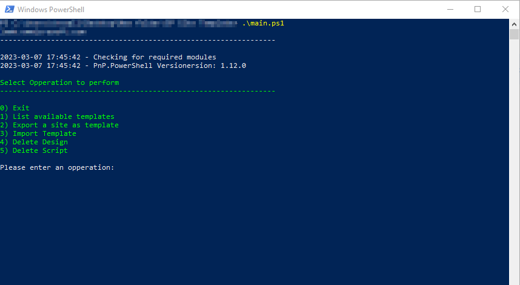

# ReadMe

This script uses the [PnP PowrShell](https://pnp.github.io/powershell/) create and manage SharePoint Online Site Designs.

## Installing PnP PowerShell

To install PnP PowerShell run this command `Install-Module -Name PnP.PowerShell`

## Authentication

To authenticat with your tenant, this solutions uses `Connect-PnPOnline` with an ___Azure App Registration___ and ___Certificate___.

If you have a certificate provided by a certificate authority, you can upload the certificate to your ___Azure App Registration___.

If you do not have a certificate, you can create a new certificate, using the proveded script, [self_signed.ps1](self_signed.ps1).

Once your ___Azure App Registration___ has been created and the certificate uploaded you need to uptade the ___Config\Config.json___ with the relevant information as described below:

- AppID: The Id of the Azure App Registration
- CertificateThumbprint: The thumbprint of your certificate. This will be desplayes when generation the certificate file, in the certificate properties or once you upload the certificate to the App Registration.
- Tenant: The url of your tenant , eg: tenat_name.onmicrosoft.com
- URL: Is the url to the SharePoint Admin portal
  
```JSON
{
    "AppId": "APP_ID",
    "CertificateThumbprint" : "YOUR_CERT_THUMBPRINT",
    "Tenant":"YOUR_TENANT_URL",
    "URL":"YOUR_SP_ADMIN_URL"
}
```

## Executing the script:

To exicute the script run : `.\main.ps1` from the project folder. This will display a menu as per the below image:



1. List available templates: This menue item allows you to display Site Scripts and Site Designs uploaded to your Tenant
2. Export a site as template: This menue item creates a site script based on the specified site. The JSON file will be saved in the __Templates__ folder with the name specified.
3. Import Template: This menu item uploads a site script to your tenant, and creates the site design based on the information provided
4. Delete Design: Deletes a site Design
5. Delete Script: Deletes a site script

When executing menue option 3 (Import Template) you will be promted if you want to set the design as the default design. If you enter yes, all new sites will be created with the default template. To restore the default desing, delete the custom design by pasing the desing id when executing menu option 4.

Currently the default site design is set to ___64___ which is the team Site template with M365 Groups. To change the template you can update the respective function and change the value for $webTemplate = "64".

- 64 = Team Site
- 68 = Communication Site
- 1 = Team Site without M365 Groups

Menu option 2, will automatically export a site as a site script in JSON format. Alternatively the `json` file can be manually creadted.
If there are specific settings you would like to implement in your script you can edit the `json` file as required. The schema and supported actions are available in the [Official Documentation](https://learn.microsoft.com/en-us/sharepoint/dev/declarative-customization/get-started-create-site-design)

If you need to implement unsuported actions, this can be done with a PowerAutomate flow.
To add a flow to your site script, you can update your json file by adding the URL of the PowerAutomate flow, eg:

```JSON
  {
      "verb": "triggerFlow",
      "url": "URL_To_Your_Flow",
      "name": "Apply Template",
      "parameters": {
          "event":"",
          "product":""
      }
````